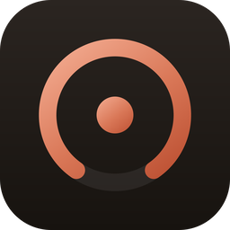
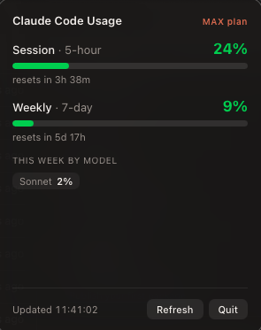

<div align="center">
  
  <h1>Agentic Usage Bar</h1>
  <p><strong>Your agentic coding limits — Claude Code &amp; Codex — live in the macOS menubar.</strong></p>
  <p>
    
    
    
  </p>
</div>

---

A tiny menubar app that keeps your agentic coding usage in front of you at all
times, so you never get surprised by a rate limit mid-flow. Supports
**Claude Code** and **Codex**:

```
C 11·8  X 8·11        ← session·weekly % per provider
```

<div align="center">
  <br/>
  
  <br/><sub><em>Always visible in the menubar — colored by severity</em></sub>
  <br/><br/>
  
  <br/><sub><em>Click for the full breakdown</em></sub>
  <br/>
</div>

## Features

- **Always-visible summary** — session (5-hour) and weekly (7-day) utilization
  per provider, rendered right in the menubar, with a gauge icon that turns
  **green → amber → red** as you approach any limit.
- **Click for detail** — a popover with one section per provider: progress
  meters, reset countdowns, per-model weekly usage, and your plan.
- **Self-updating** — refreshes automatically every 2 minutes (and the moment
  you open the popover). A manual **Refresh** button is there too.
- **Independent providers** — a provider that isn't signed in is simply
  hidden; one being offline never affects the other.
- **Menubar-only** — no Dock icon, no window clutter.

## How it works

The app piggybacks on the credentials each CLI already manages — no login flow
of its own, and it never refreshes tokens itself:

| Provider | Credentials | Usage endpoint |
| --- | --- | --- |
| Claude Code | macOS Keychain (`Claude Code-credentials`) | `GET api.anthropic.com/api/oauth/usage` |
| Codex | `~/.codex/auth.json` | `GET chatgpt.com/backend-api/wham/usage` |

Credentials are read fresh on every poll, so the app always uses whatever
token the CLI last refreshed.

> ⚠️ Both usage endpoints are **undocumented** and may change without notice.
> If a field disappears the app degrades gracefully rather than crashing.

## Privacy

Your credentials never leave your machine except in the `Authorization` header
sent to each provider's own API (`api.anthropic.com`, `chatgpt.com`) — the same
places the CLIs already talk to. There is no telemetry and no third-party
network traffic.

## Requirements

- macOS
- [Claude Code](https://claude.com/claude-code) and/or
  [Codex](https://developers.openai.com/codex) installed and signed in
- For building: [Rust](https://rustup.rs), Xcode command-line tools, and
  [Bun](https://bun.sh)

## Build & run

```bash
bun install

# develop (hot reload)
bun run tauri dev

# build a release .app / .dmg
bun run tauri build
```

The bundled app lands in `src-tauri/target/release/bundle/`.

## Tech

- **[Tauri v2](https://tauri.app)** — Rust host + system WebView
- Rust: `reqwest` (rustls), `serde`, `tokio`, `chrono`, `tauri-plugin-positioner`
- Frontend: Vite + vanilla TypeScript (no framework)

## License

MIT
